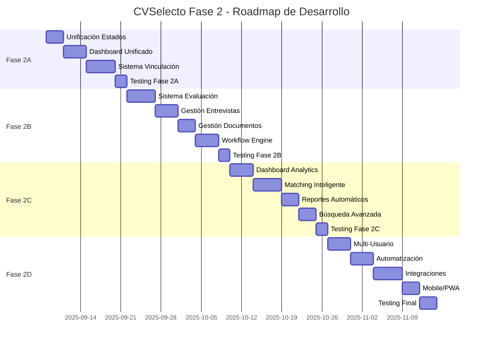

# 📋 ANÁLISIS FUNCIONAL COMPLETO - FASE 2 CVSelecto

## 🎯 **RESUMEN EJECUTIVO**

Tras realizar una auditoría profunda del sistema CVSelecto, identifico **3 vistas críticas** del usuario Empresa que requieren consolidación, optimización e integración para alcanzar un nivel profesional completo. El análisis revela funcionalidades fragmentadas que deben unificarse bajo un enfoque coherente y escalable.

---

## 📌 **1. ANÁLISIS FUNCIONAL POR VISTA**

### 🟦 **A. Vista `/postulaciones` (Gestión de Candidatos)**

**📍 Archivos Principales:**
- `frontend/src/views/GestionCandidatos.js`
- `frontend/src/components/TabPostulaciones.js` 
- `app/Http/Controllers/Api/PostulacionController.php`

**✅ Funcionalidades Implementadas:**
1. **Dashboard de Estadísticas**: Cards con contadores por estado (postulado, en proceso, seleccionado, rechazado)
2. **Listado de Postulaciones**: Tabla con candidato, búsqueda, estado, fecha, puntuación y notas
3. **Gestión de Estados**: Cambio de estado (postulado → en proceso → seleccionado/rechazado)
4. **Sistema de Calificación**: Puntuación 1-10 con notas empresa
5. **Filtros por Estado**: Dropdown para filtrar postulaciones
6. **Vista de Detalles**: Navegación a perfil completo del candidato
7. **API Endpoints**: CRUD completo + endpoints especializados

**❌ Funcionalidades Faltantes:**
1. **🚨 Flujo de Evaluación Estructurado**: No hay proceso paso a paso definido
2. **📧 Sistema de Notificaciones**: Sin comunicación automatizada con candidatos
3. **📁 Gestión de Documentos**: No se pueden ver CVs o documentos adjuntos
4. **🔄 Historial de Interacciones**: Sin registro de cambios y comunicaciones
5. **📊 Analytics Avanzados**: Métricas de conversión por fuente, tiempo promedio por etapa
6. **⚡ Acciones en Masa**: No se pueden procesar múltiples postulaciones simultáneamente
7. **🎯 Criterios de Evaluación**: Sin sistema de scoring automático o manual estructurado

### 🟩 **B. Vista `/pool-candidatos` (Pool Privado de Candidatos)**

**📍 Archivos Principales:**
- `frontend/src/views/PoolCandidatos.js`
- `frontend/src/components/TarjetaCandidatoResponsiva.js`
- `frontend/src/components/DetalleCandidato.js`
- `app/Http/Controllers/Api/EmpresaPoolController.php`

**✅ Funcionalidades Implementadas:**
1. **Gestión Completa del Pool**: CRUD de candidatos en pool privado
2. **Sistema de Filtros Avanzados**: Por estado, origen, puntuación, tags, búsqueda textual
3. **Agregar Candidatos Existentes**: Importación desde base de datos general
4. **Crear Candidatos Manuales**: Formulario completo para nuevos candidatos
5. **Estados Internos**: Activo, en proceso, contratado, descartado, pausado
6. **Sistema de Tags**: Etiquetado libre para organización
7. **Puntuación Empresarial**: Rating 1-10 independiente de postulaciones
8. **Notas Privadas**: Observaciones internas no visibles para candidatos
9. **Vista de Tarjetas Responsiva**: Display organizado y profesional
10. **Modales de Detalle**: Información completa con edición rápida
11. **Importación desde Postulaciones**: Mover candidatos de postulaciones a pool
12. **Paginación y Ordenamiento**: Navegación fluida para pools grandes

**❌ Funcionalidades Faltantes:**
1. **🔗 Vinculación con Búsquedas**: Sin conexión directa pool ↔ búsquedas específicas
2. **📈 Seguimiento de Pipeline**: No hay visualización de funnel de conversión
3. **📅 Gestión de Entrevistas**: Sin calendario ni scheduling integrado
4. **📊 Comparación de Candidatos**: Sin herramientas de comparación lado a lado
5. **🤖 Matching Inteligente**: Sin sugerencias automáticas basadas en criterios
6. **📤 Acciones de Outreach**: Sin herramientas de contacto masivo o personalizado
7. **🔄 Sincronización**: Sin actualización automática desde otras fuentes

### 🟨 **C. Vista `/mis-busquedas-laborales` (Gestión de Ofertas)**

**📍 Archivos Principales:**
- `frontend/src/views/ListaBusquedas.js`
- `frontend/src/views/CrearBusquedaLaboral.js`
- `frontend/src/views/EditarBusquedaLaboral.js`
- `frontend/src/views/BusquedaDetalle.js`
- `app/Http/Controllers/Api/BusquedaLaboralController.php`

**✅ Funcionalidades Implementadas:**
1. **CRUD Completo de Búsquedas**: Crear, editar, listar, eliminar ofertas laborales
2. **Formulario Completo**: 15+ campos (título, descripción, requisitos, beneficios, salario, modalidad, etc.)
3. **Estados de Publicación**: Abierta, pausada, cerrada
4. **Gestión de Estados**: Cambio de estado en tiempo real
5. **Filtros por Estado**: Vista filtrada de búsquedas
6. **Configuración de Fechas**: Fecha publicación y cierre
7. **Vista de Estadísticas**: Contador de postulaciones por búsqueda
8. **Navegación Integrada**: Enlaces a gestión de candidatos y edición

**❌ Funcionalidades Faltantes:**
1. **📊 Dashboard de Performance**: Sin métricas de efectividad por oferta
2. **🎯 Gestión de Candidatos por Búsqueda**: Vista unificada búsqueda + postulaciones
3. **📋 Templates de Búsquedas**: Sin plantillas predefinidas reutilizables
4. **🔄 Duplicación de Búsquedas**: Sin clonado rápido de ofertas similares
5. **📈 Analytics de Alcance**: Sin métricas de visualizaciones, aplicaciones por fuente
6. **💼 Gestión de Pipeline por Búsqueda**: Sin vista kanban del proceso de selección
7. **🚀 Promoción y Distribución**: Sin integración con job boards externos
8. **📋 Questionnaire Builder**: Sin formularios personalizados por búsqueda

---

## 🧱 **2. AUDITORÍA TÉCNICA**

### ✅ **Fortalezas de la Arquitectura Actual**

1. **🎯 Separación de Responsabilidades Clara**:
   - Controladores especializados (PostulacionController, EmpresaPoolController, BusquedaLaboralController)
   - Modelos con relaciones bien definidas
   - Requests de validación dedicados

2. **📊 Modelos Robustos**:
   - `Empresa` con métodos de pool avanzados
   - `Postulacion` con estados claros
   - `BusquedaLaboral` con campos completos
   - Relaciones many-to-many con tabla pivot `empresa_candidatos`

3. **🔌 API RESTful Consistente**:
   - Endpoints especializados por dominio
   - Respuestas JSON estructuradas
   - Validación de datos en backend

4. **🎨 Frontend Componentizado**:
   - Componentes reutilizables (TabPostulaciones, DetalleCandidato)
   - Context API para gestión de estado
   - Navegación coherente

### ⚠️ **Debilidades y Fragmentaciones Detectadas**

1. **🔄 Falta de Integración Entre Vistas**:
   - Pool, postulaciones y búsquedas funcionan en silos
   - No hay flujo unificado empresa → búsqueda → candidatos → evaluación

2. **📊 Inconsistencias en Estados**:
   - Estados diferentes entre postulaciones y pool (`en proceso` vs `en_proceso`)
   - Sin estados globales unificados del candidato en el contexto empresarial

3. **🚫 Funcionalidades Duplicadas**:
   - Calificación tanto en postulaciones como en pool
   - Gestión de candidatos dispersa entre vistas

4. **📈 Falta de Flujo de Trabajo Definido**:
   - No hay proceso step-by-step para reclutamiento
   - Acciones aisladas sin conexión lógica

5. **🔍 Búsquedas y Filtros Inconsistentes**:
   - Diferentes implementaciones de filtrado
   - Sin persistencia de filtros entre sesiones

---

## 🗂️ **3. PLANIFICACIÓN POR FASES**

### 🎯 **FASE 2A: Consolidación de Funcionalidades Core** 
**(Semana 1-2) - Base Sólida**

**🎯 Objetivo Técnico**: Unificar los sistemas existentes bajo un modelo de datos coherente y flujos de trabajo integrados.

**🎯 Objetivo Funcional**: Crear una experiencia empresarial cohesiva donde postulaciones, pool y búsquedas trabajen como un sistema unificado.

**📋 Tareas Específicas**:

1. **🔄 Unificación de Estados de Candidatos**
   - Crear enum global de estados: `POSTULADO`, `EN_REVISION`, `ENTREVISTA`, `SELECCIONADO`, `RECHAZADO`, `EN_POOL`, `CONTRATADO`
   - Migración para normalizar estados existentes
   - Actualizar validaciones en Request classes

2. **🎯 Dashboard Empresarial Unificado** 
   - Crear `CentroGestionCandidatos.js` que combine las 3 vistas actuales
   - Implementar navegación por tabs entre Pool, Postulaciones y Búsquedas
   - Dashboard con métricas globales cross-funcionales

3. **🔗 Sistema de Vinculación Candidato-Búsqueda**
   - Endpoint `/pool-candidatos/{candidato}/vincular-busqueda/{busqueda}`
   - Funcionalidad "Matching Suggestions" automático
   - Vista de candidatos potenciales por búsqueda específica

**🎯 Criterios de Validación**:
- ✅ Un candidato puede moverse fluidamente entre pool y postulaciones
- ✅ Estados consistentes en toda la aplicación
- ✅ Métricas unificadas por empresa
- ✅ Navegación intuitiva entre funcionalidades

**🔗 Dependencias**: Completar migración base de datos → Frontend unificado → Testing integral

---

### 🎯 **FASE 2B: Flujo de Evaluación Profesional**
**(Semana 3-4) - Proceso Estructurado**

**🎯 Objetivo Técnico**: Implementar un workflow engine para el proceso de evaluación y selección de candidatos.

**🎯 Objetivo Funcional**: Proveer a las empresas un proceso paso a paso profesional para evaluar candidatos con criterios objetivos.

**📋 Tareas Específicas**:

1. **📋 Sistema de Evaluación Estructurada**
   - Crear modelo `EvaluacionCandidato` con criterios customizables
   - Formularios de evaluación por etapas (screening, entrevista técnica, cultural fit)
   - Scoring automático basado en criterios ponderados

2. **📅 Gestión de Entrevistas**
   - Modelo `Entrevista` con estados y tipos
   - Calendario integrado para scheduling
   - Notificaciones automáticas por email

3. **📄 Gestión de Documentos**
   - Upload y visualización de CVs, portfolios, certificados
   - Sistema de comentarios en documentos
   - Versionado de documentos

4. **🔄 Workflow Engine**
   - Estado machine para candidatos: Postulación → Screening → Entrevista → Decisión
   - Triggers automáticos (emails, tasks, notificaciones)
   - Templates customizables por empresa

**🎯 Criterios de Validación**:
- ✅ Proceso de evaluación consistente y replicable
- ✅ Candidatos con historial completo de interacciones
- ✅ Tiempos de respuesta automáticos configurables
- ✅ Documentos organizados y accesibles

**🔗 Dependencias**: Fase 2A completada → Email service configurado → Storage para documentos

---

### 🎯 **FASE 2C: Analytics y Optimización**
**(Semana 5-6) - Inteligencia de Negocio**

**🎯 Objetivo Técnico**: Implementar sistema de métricas, analytics y reportes para optimización continua del proceso de reclutamiento.

**🎯 Objetivo Funcional**: Dotar a las empresas de insights accionables para mejorar sus procesos de reclutamiento y toma de decisiones basada en datos.

**📋 Tareas Específicas**:

1. **📊 Dashboard de Analytics Empresarial**
   - Métricas de funnel de conversión por búsqueda
   - Time-to-hire promedio y por rol
   - Fuentes de candidatos más efectivas
   - Cost-per-hire y quality-of-hire metrics

2. **🎯 Sistema de Matching Inteligente**
   - Algoritmo de scoring automático candidato-búsqueda
   - Sugerencias de candidatos del pool para nuevas búsquedas
   - ML básico para aprender de decisiones históricas

3. **📈 Reportes Automáticos**
   - Reportes semanales/mensuales por email
   - Comparación con benchmarks de industria
   - Identificación de cuellos de botella en el proceso

4. **🔍 Búsqueda Avanzada y Filtros Inteligentes**
   - Búsqueda semántica en candidatos
   - Filtros combinados con guardado de búsquedas
   - Alertas automáticas para nuevos candidatos que coincidan

**🎯 Criterios de Validación**:
- ✅ Dashboard con métricas actualizadas en tiempo real
- ✅ Sugerencias automáticas relevantes y útiles
- ✅ Reportes que aporten insights accionables
- ✅ Mejora medible en eficiencia del proceso

**🔗 Dependencias**: Fases 2A y 2B → Datos históricos suficientes → Configuración de ML básico

---

### 🎯 **FASE 2D: Experiencia Premium y Escalabilidad**
**(Semana 7-8) - Funcionalidades Avanzadas**

**🎯 Objetivo Técnico**: Implementar funcionalidades premium que posicionen a CVSelecto como una plataforma de reclutamiento de nivel empresarial.

**🎯 Objetivo Funcional**: Ofrecer capacidades avanzadas que permitan a empresas grandes escalar sus procesos de reclutamiento eficientemente.

**📋 Tareas Específicas**:

1. **👥 Colaboración Multi-Usuario**
   - Roles granulares: Recruiter, Hiring Manager, Interviewer, Admin
   - Sistema de permisos por búsqueda y candidato
   - Comentarios colaborativos y mentions

2. **🚀 Automatización Avanzada**
   - Email campaigns automáticos
   - Templates de respuesta personalizable
   - Workflow automation rules (if-then logic)

3. **🔌 Integraciones Externas**
   - API para job boards (LinkedIn, Indeed, etc.)
   - Integración con calendarios (Google, Outlook)
   - Webhooks para sistemas externos

4. **📱 Optimización Mobile y PWA**
   - Responsive design perfeccionado
   - Progressive Web App capabilities
   - Notifications push para móviles

**🎯 Criterios de Validación**:
- ✅ Equipos de reclutamiento pueden colaborar eficientemente
- ✅ Procesos altamente automatizados con intervención mínima
- ✅ Integración fluida con herramientas existentes
- ✅ Experiencia móvil comparable a desktop

**🔗 Dependencias**: Todas las fases anteriores → API externa configuradas → Testing mobile

---

## ⚠️ **4. PRECAUCIONES Y CONSIDERACIONES**

### 🛡️ **Principios de Desarrollo**

1. **🔒 Backward Compatibility**: Todas las migraciones deben mantener compatibilidad con datos existentes
2. **📊 Data Integrity**: Validaciones estrictas en todos los niveles (frontend, backend, database)
3. **🧪 Testing First**: Test coverage mínimo 80% para funcionalidades críticas
4. **📚 Documentación**: Cada API endpoint debe estar documentado en Swagger
5. **🚀 Performance**: Lazy loading, paginación y caching para escalabilidad

### 🎯 **Criterios de Calidad**

1. **⚡ Performance**: Tiempo de carga < 2 segundos para vistas principales
2. **📱 Responsiveness**: Funcionalidad completa en mobile/tablet
3. **♿ Accessibility**: Cumplimiento WCAG 2.1 AA mínimo
4. **🔐 Security**: Validación de permisos en cada endpoint
5. **🌐 Internationalization**: Preparado para múltiples idiomas

### 🔄 **Proceso de Validación por Fase**

Cada fase debe superar:
- ✅ **Code Review** completo
- ✅ **Testing funcional** automatizado
- ✅ **Testing de integración** con fases anteriores
- ✅ **User Acceptance Testing** con usuarios reales
- ✅ **Performance testing** bajo carga
- ✅ **Security audit** básico

---

## 🎯 **5. ROADMAP DE IMPLEMENTACIÓN**

**🎯 Estimación Total: 8 semanas (40 días hábiles)**

---

## 🚀 **PRÓXIMOS PASOS INMEDIATOS**

1. **✅ Aprobación del Plan**: Review y ajustes del roadmap propuesto
2. **🔧 Setup Técnico**: Configuración de environment para Fase 2A
3. **📋 Preparación de Tareas**: Detalle técnico de primeras implementaciones
4. **🧪 Setup de Testing**: Configuración de testing suite completo

**¿Estás listo para comenzar con la Fase 2A?** 🚀
