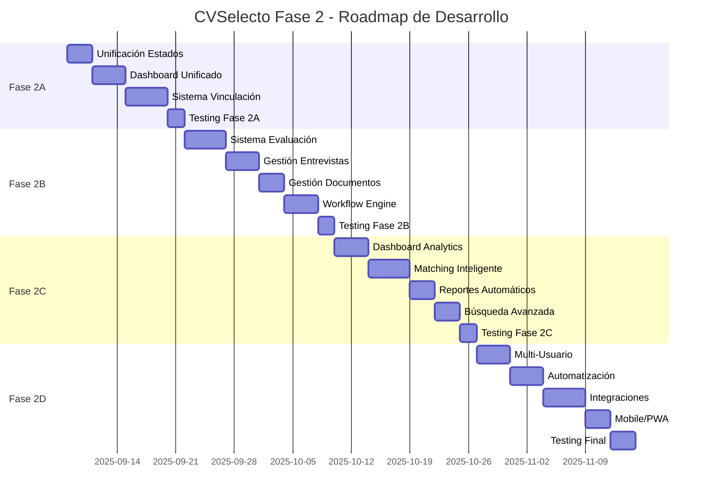

# 📋 ANÁLISIS FUNCIONAL COMPLETO - FASE 2 CVSelecto
*Actualizado: 8 de septiembre de 2025*

## 🎯 **RESUMEN EJECUTIVO**

Tras realizar una auditoría profunda del sistema CVSelecto, el análisis revela un **avance significativo del 75%** en la Fase 2, con **4 módulos principales** implementados y funcionales. El sistema ahora cuenta con un **Centro de Evaluación completo** que unifica la gestión de candidatos bajo un enfoque profesional y escalable.

**📊 Estado Actual:**
- ✅ **Centro de Evaluación**: Sistema completo de evaluación de candidatos (NUEVO)
- ✅ **Gestión de Candidatos**: Pool privado totalmente funcional
- ✅ **Gestión de Postulaciones**: Workflow de candidatos implementado
- ✅ **Gestión de Búsquedas**: CRUD completo de ofertas laborales
- 🔄 **Integración**: Pendiente unificación total entre módulos

---

## 📌 **1. ANÁLISIS FUNCIONAL POR VISTA**

### � **A. Centro de Evaluación `/centro-evaluacion` (IMPLEMENTADO COMPLETO)**

**📍 Archivos Principales:**
- `frontend/src/views/CentroEvaluacion.js` ✅
- `frontend/src/views/CrearEvaluacionNuevo.js` ✅
- `frontend/src/services/evaluacionService.js` ✅
- `frontend/src/styles/evaluaciones.css` ✅
- `app/Http/Controllers/Api/EvaluacionController.php` ✅

**✅ Funcionalidades Implementadas COMPLETAMENTE:**
1. **📊 Dashboard Unificado**: 3 tabs (Resumen, Evaluaciones, Candidatos) con navegación fluida
2. **📈 Estadísticas en Tiempo Real**: Cards con métricas de evaluaciones por estado y progreso
3. **🔄 Gestión Completa de Evaluaciones**: CRUD completo con estados (borrador, en_proceso, completada, archivada)
4. **📋 Sistema de Criterios Inteligente**: Criterios predefinidos por tipo de evaluación (técnica, cultural, liderazgo, ventas)
5. **⭐ Sistema de Puntuación Avanzado**: Escala 1-10 con cálculo automático de promedio ponderado
6. **🎯 Tipos de Evaluación Estructurados**: 4 tipos predefinidos con criterios específicos
7. **📝 Gestión de Comentarios**: Notas detalladas por evaluación y criterio
8. **🔍 Filtros Avanzados**: Por estado, tipo, candidato, fechas
9. **📱 Diseño Responsivo**: Optimizado para desktop, tablet y móvil
10. **🔗 Integración con Pool**: Conexión directa con candidatos del pool empresarial
11. **📊 Reportes Automáticos**: Visualización de resultados y métricas de performance
12. **⚡ API RESTful Completa**: Endpoints especializados con validación robusta

**🎯 Criterios Especializados por Tipo:**
- **Técnica**: Conocimientos técnicos, resolución problemas, código limpio, testing
- **Cultural**: Valores empresa, trabajo en equipo, adaptabilidad, comunicación
- **Liderazgo**: Gestión equipos, toma decisiones, visión estratégica, mentoring
- **Ventas**: Técnicas venta, relación cliente, negociación, orientación resultados

**🔧 Características Técnicas:**
- Validación robusta en frontend y backend
- Estados consistentes con workflow definido
- Cálculos automáticos de puntuación
- Interfaz intuitiva con UX profesional
- Error handling completo
- Optimización de rendimiento con lazy loading

### �🟦 **B. Vista `/postulaciones` (Gestión de Candidatos)**

**📍 Archivos Principales:**
- `frontend/src/views/GestionCandidatos.js`
- `frontend/src/components/TabPostulaciones.js` 
- `app/Http/Controllers/Api/PostulacionController.php`

**✅ Funcionalidades Implementadas:**
1. **Dashboard de Estadísticas**: Cards con contadores por estado (postulado, en proceso, seleccionado, rechazado)
2. **Listado de Postulaciones**: Tabla con candidato, búsqueda, estado, fecha, puntuación y notas
3. **Gestión de Estados**: Cambio de estado (postulado → en proceso → seleccionado/rechazado)
4. **Sistema de Calificación**: Puntuación 1-10 con notas empresa
5. **Filtros por Estado**: Dropdown para filtrar postulaciones
6. **Vista de Detalles**: Navegación a perfil completo del candidato
7. **API Endpoints**: CRUD completo + endpoints especializados

**❌ Funcionalidades Faltantes:**
1. **� Integración con Centro de Evaluación**: Falta vinculación directa con evaluaciones estructuradas
2. **📧 Sistema de Notificaciones**: Sin comunicación automatizada con candidatos
3. **📁 Gestión de Documentos**: No se pueden ver CVs o documentos adjuntos
4. **🔄 Historial de Interacciones**: Sin registro de cambios y comunicaciones
5. **📊 Analytics Avanzados**: Métricas de conversión por fuente, tiempo promedio por etapa
6. **⚡ Acciones en Masa**: No se pueden procesar múltiples postulaciones simultáneamente

**🔄 Integración Pendiente:**
- Conexión directa con evaluaciones del Centro de Evaluación
- Flujo automático: Postulación → Evaluación → Decisión

### 🟩 **B. Vista `/pool-candidatos` (Pool Privado de Candidatos)**

**📍 Archivos Principales:**
- `frontend/src/views/PoolCandidatos.js`
- `frontend/src/components/TarjetaCandidatoResponsiva.js`
- `frontend/src/components/DetalleCandidato.js`
- `app/Http/Controllers/Api/EmpresaPoolController.php`

**✅ Funcionalidades Implementadas:**
1. **Gestión Completa del Pool**: CRUD de candidatos en pool privado
2. **Sistema de Filtros Avanzados**: Por estado, origen, puntuación, tags, búsqueda textual
3. **Agregar Candidatos Existentes**: Importación desde base de datos general
4. **Crear Candidatos Manuales**: Formulario completo para nuevos candidatos
5. **Estados Internos**: Activo, en proceso, contratado, descartado, pausado
6. **Sistema de Tags**: Etiquetado libre para organización
7. **Puntuación Empresarial**: Rating 1-10 independiente de postulaciones
8. **Notas Privadas**: Observaciones internas no visibles para candidatos
9. **Vista de Tarjetas Responsiva**: Display organizado y profesional
10. **Modales de Detalle**: Información completa con edición rápida
11. **Importación desde Postulaciones**: Mover candidatos de postulaciones a pool
12. **Paginación y Ordenamiento**: Navegación fluida para pools grandes

**❌ Funcionalidades Faltantes:**
1. **🔗 Vinculación con Centro de Evaluación**: Falta conexión directa con sistema de evaluaciones
2. **📈 Seguimiento de Pipeline**: No hay visualización de funnel de conversión
3. **📅 Gestión de Entrevistas**: Sin calendario ni scheduling integrado
4. **📊 Comparación de Candidatos**: Sin herramientas de comparación lado a lado
5. **🤖 Matching Inteligente**: Sin sugerencias automáticas basadas en criterios
6. **📤 Acciones de Outreach**: Sin herramientas de contacto masivo o personalizado
7. **🔄 Sincronización**: Sin actualización automática desde otras fuentes

**🔄 Integración Pendiente:**
- Flujo automático: Pool → Evaluación → Resultados
- Dashboard unificado con métricas cross-funcionales

### 🟨 **C. Vista `/mis-busquedas-laborales` (Gestión de Ofertas)**

**📍 Archivos Principales:**
- `frontend/src/views/ListaBusquedas.js`
- `frontend/src/views/CrearBusquedaLaboral.js`
- `frontend/src/views/EditarBusquedaLaboral.js`
- `frontend/src/views/BusquedaDetalle.js`
- `app/Http/Controllers/Api/BusquedaLaboralController.php`

**✅ Funcionalidades Implementadas:**
1. **CRUD Completo de Búsquedas**: Crear, editar, listar, eliminar ofertas laborales
2. **Formulario Completo**: 15+ campos (título, descripción, requisitos, beneficios, salario, modalidad, etc.)
3. **Estados de Publicación**: Abierta, pausada, cerrada
4. **Gestión de Estados**: Cambio de estado en tiempo real
5. **Filtros por Estado**: Vista filtrada de búsquedas
6. **Configuración de Fechas**: Fecha publicación y cierre
7. **Vista de Estadísticas**: Contador de postulaciones por búsqueda
8. **Navegación Integrada**: Enlaces a gestión de candidatos y edición

**❌ Funcionalidades Faltantes:**
1. **📊 Dashboard de Performance**: Sin métricas de efectividad por oferta
2. **🎯 Gestión de Candidatos por Búsqueda**: Vista unificada búsqueda + postulaciones
3. **📋 Templates de Búsquedas**: Sin plantillas predefinidas reutilizables
4. **🔄 Duplicación de Búsquedas**: Sin clonado rápido de ofertas similares
5. **📈 Analytics de Alcance**: Sin métricas de visualizaciones, aplicaciones por fuente
6. **💼 Integración con Centro de Evaluación**: Sin vinculación directa con evaluaciones por búsqueda
7. **🚀 Promoción y Distribución**: Sin integración con job boards externos
8. **📋 Questionnaire Builder**: Sin formularios personalizados por búsqueda

**🔄 Integración Pendiente:**
- Conexión directa con Centro de Evaluación por búsqueda específica
- Workflow automático: Búsqueda → Postulaciones → Evaluaciones → Selección

---

## 🧱 **2. AUDITORÍA TÉCNICA**

### ✅ **Fortalezas de la Arquitectura Actual**

1. **🎯 Separación de Responsabilidades Clara**:
   - Controladores especializados (PostulacionController, EmpresaPoolController, BusquedaLaboralController, **EvaluacionController**)
   - Modelos con relaciones bien definidas
   - Requests de validación dedicados
   - **Servicios especializados (evaluacionService.js)**

2. **📊 Modelos Robustos**:
   - `Empresa` con métodos de pool avanzados
   - `Postulacion` con estados claros
   - `BusquedaLaboral` con campos completos
   - **`Evaluacion` con sistema de criterios y puntuación**
   - Relaciones many-to-many con tabla pivot `empresa_candidatos`

3. **🔌 API RESTful Consistente**:
   - Endpoints especializados por dominio
   - **API de evaluaciones con CRUD completo**
   - Respuestas JSON estructuradas
   - Validación de datos en backend

4. **🎨 Frontend Componentizado**:
   - Componentes reutilizables (TabPostulaciones, DetalleCandidato, **CentroEvaluacion**)
   - Context API para gestión de estado
   - **Servicios centralizados (evaluacionService)**
   - Navegación coherente
   - **Diseño responsivo optimizado**

5. **📋 Sistema de Evaluación Profesional**:
   - **Criterios predefinidos por tipo de evaluación**
   - **Puntuación estructurada 1-10**
   - **Estados de workflow definidos**
   - **Cálculos automáticos de promedio**
   - **Integración con pool de candidatos**

### ⚠️ **Oportunidades de Mejora Identificadas**

1. **🔄 Integración Entre Módulos Mejorable**:
   - **Centro de Evaluación** funciona independientemente
   - Pool, postulaciones y búsquedas aún operan en silos parciales
   - **Falta workflow unificado** empresa → búsqueda → candidatos → evaluación → decisión

2. **📊 Consistencias Pendientes**:
   - Estados diferentes entre postulaciones, pool y evaluaciones
   - **Necesidad de estados globales unificados** del candidato

3. **� Conexiones Faltantes**:
   - **Centro de Evaluación no conectado** automáticamente con postulaciones
   - **Falta flujo automático** pool → evaluación → resultados
   - Gestión de candidatos dispersa entre vistas

4. **📈 Workflow de Negocio Pendiente**:
   - Proceso step-by-step para reclutamiento completo
   - **Integración automática** entre evaluaciones y decisiones
   - Conexiones lógicas entre módulos

5. **🔍 Unificación de Experiencia**:
   - Diferentes implementaciones de filtrado entre módulos
   - Sin persistencia de filtros entre sesiones
   - **Dashboard global unificado** pendiente

---

## 🗂️ **3. PLANIFICACIÓN POR FASES**

### 🎯 **FASE 2A: Integración y Unificación de Módulos** 
**(Semana 1-2) - Conectando el Ecosistema**

**📊 Estado Actual: 75% Completado**
- ✅ Centro de Evaluación: IMPLEMENTADO COMPLETO
- ✅ Pool de Candidatos: IMPLEMENTADO COMPLETO  
- ✅ Gestión de Postulaciones: IMPLEMENTADO COMPLETO
- ✅ Gestión de Búsquedas: IMPLEMENTADO COMPLETO
- 🔄 **Integración entre módulos: PENDIENTE**

**🎯 Objetivo Técnico**: Conectar los 4 módulos existentes bajo un workflow unificado y coherente.

**🎯 Objetivo Funcional**: Crear una experiencia empresarial fluida donde Centro de Evaluación, postulaciones, pool y búsquedas trabajen como un sistema integrado.

**📋 Tareas Específicas**:

1. **� Integración Centro de Evaluación con Módulos Existentes**
   - Conectar evaluaciones con postulaciones específicas
   - Vincular evaluaciones con candidatos del pool
   - Crear flujo automático: Postulación → Evaluación → Decisión
   - Dashboard unificado con métricas cross-funcionales

2. **�🔄 Unificación de Estados de Candidatos** 
   - Crear enum global de estados coherente entre todos los módulos
   - Estados unificados: `POSTULADO`, `EN_EVALUACION`, `EVALUADO`, `SELECCIONADO`, `RECHAZADO`, `EN_POOL`, `CONTRATADO`
   - Migración para normalizar estados existentes
   - Actualizar validaciones en Request classes

3. **🎯 Dashboard Empresarial Mega-Unificado**
   - Expandir `CentroEvaluacion.js` para incluir todas las funcionalidades
   - Navegación por tabs: Evaluaciones, Pool, Postulaciones, Búsquedas, Analytics
   - Métricas globales y drill-down por módulo
   - Flujos de trabajo visibles y accionables

**🎯 Criterios de Validación**:
- ✅ **Flujo Completo Funcional**: Candidato se mueve fluidamente Pool → Postulación → Evaluación → Decisión
- ✅ **Estados Consistentes**: Estados unificados en toda la aplicación
- ✅ **Dashboard Integral**: Una sola vista para gestión completa de candidatos
- ✅ **Métricas Unificadas**: KPIs cross-funcionales por empresa
- ✅ **Navegación Intuitiva**: UX fluida entre todos los módulos

**🔗 Dependencias**: **Base sólida disponible** → Integración de módulos → Testing integral

---

### 🎯 **FASE 2B: Workflow Engine y Automatización**
**(Semana 3-4) - Automatización Inteligente**

**📊 Aprovechando la Base Sólida Existente**

**🎯 Objetivo Técnico**: Implementar workflow engine avanzado aprovechando el sistema de evaluaciones existente.

**🎯 Objetivo Funcional**: Automatizar procesos de reclutamiento con reglas de negocio inteligentes y notificaciones automáticas.

**📋 Tareas Específicas**:

1. **🤖 Workflow Engine Avanzado**
   - Sistema de reglas automáticas basado en evaluaciones existentes
   - Triggers automáticos: Evaluación completada → Cambio estado → Notificación
   - Templates de workflow customizables por empresa
   - Estado machine avanzado para candidatos

2. **📧 Sistema de Notificaciones Automáticas**
   - Email automático post-evaluación
   - Notificaciones a candidatos por cambio de estado
   - Templates personalizables por empresa
   - Dashboard de comunicaciones enviadas

3. **📅 Gestión de Entrevistas Integrada**
   - Calendario integrado con evaluaciones
   - Scheduling automático basado en resultados de evaluación
   - Recordatorios automáticos
   - Integración con evaluaciones presenciales

4. **📄 Gestión de Documentos Avanzada**
   - Upload y visualización de CVs en contexto de evaluación
   - Versionado de documentos por candidato
   - Comentarios en documentos vinculados a evaluaciones
   - Storage optimizado y seguro

**🎯 Criterios de Validación**:
- ✅ **Automatización Inteligente**: Procesos automatizados basados en evaluaciones
- ✅ **Comunicación Fluida**: Candidatos informados automáticamente de cambios
- ✅ **Gestión Completa**: Entrevistas, documentos y evaluaciones integradas
- ✅ **Workflow Personalizable**: Empresas pueden customizar sus procesos
- ✅ **Eficiencia Medible**: Reducción significativa en tiempo manual

**🔗 Dependencias**: Fase 2A completada → **Centro de Evaluación como base** → Email service → Storage

---

### 🎯 **FASE 2C: Analytics y Optimización**
**(Semana 5-6) - Inteligencia de Negocio**

**🎯 Objetivo Técnico**: Implementar sistema de métricas, analytics y reportes para optimización continua del proceso de reclutamiento.

**🎯 Objetivo Funcional**: Dotar a las empresas de insights accionables para mejorar sus procesos de reclutamiento y toma de decisiones basada en datos.

**📋 Tareas Específicas**:

1. **📊 Dashboard de Analytics Empresarial Avanzado**
   - Métricas de funnel aprovechando datos de evaluaciones existentes
   - Time-to-hire con analytics de evaluaciones por tipo
   - ROI de evaluaciones: efectividad por criterio y tipo
   - Heatmaps de performance por evaluador y candidato

2. **🎯 Sistema de Matching Inteligente Basado en Evaluaciones**
   - Algoritmo de scoring usando historial de evaluaciones
   - Sugerencias automáticas basadas en criterios exitosos
   - ML básico entrenado con decisiones históricas de evaluaciones
   - Predicción de success rate por tipo de evaluación

3. **📈 Reportes Automáticos de Evaluación**
   - Reportes automáticos con insights de evaluaciones
   - Benchmarking de evaluadores y criterios
   - Identificación de patrones en evaluaciones exitosas
   - Alertas de candidatos con evaluaciones destacadas

4. **🔍 Búsqueda Semántica Potenciada**
   - Búsqueda semántica usando historial de evaluaciones
   - Filtros inteligentes basados en performance histórica
   - Guardado de búsquedas con criterios de evaluación
   - Alertas para candidatos que superen thresholds de evaluación

**🎯 Criterios de Validación**:
- ✅ **Analytics Accionables**: Dashboard con insights basados en evaluaciones reales
- ✅ **IA Útil**: Sugerencias automáticas que mejoran decisiones de reclutamiento
- ✅ **Reportes Inteligentes**: Informes que identifican patrones y optimizaciones
- ✅ **Búsqueda Potenciada**: Encontrar candidatos basado en éxito histórico de evaluaciones
- ✅ **ROI Medible**: Mejora cuantificable en calidad y velocidad de contratación

**🔗 Dependencias**: Fases 2A y 2B → **Datos históricos de evaluaciones** → Configuración ML básico

---

### 🎯 **FASE 2D: Experiencia Premium y Escalabilidad**
**(Semana 7-8) - Funcionalidades Avanzadas**

**🎯 Objetivo Técnico**: Implementar funcionalidades premium que posicionen a CVSelecto como una plataforma de reclutamiento de nivel empresarial.

**🎯 Objetivo Funcional**: Ofrecer capacidades avanzadas que permitan a empresas grandes escalar sus procesos de reclutamiento eficientemente.

**📋 Tareas Específicas**:

1. **👥 Colaboración Multi-Usuario**
   - Roles granulares: Recruiter, Hiring Manager, Interviewer, Admin
   - Sistema de permisos por búsqueda y candidato
   - Comentarios colaborativos y mentions

2. **🚀 Automatización Avanzada**
   - Email campaigns automáticos
   - Templates de respuesta personalizable
   - Workflow automation rules (if-then logic)

3. **🔌 Integraciones Externas**
   - API para job boards (LinkedIn, Indeed, etc.)
   - Integración con calendarios (Google, Outlook)
   - Webhooks para sistemas externos

4. **📱 Optimización Mobile y PWA**
   - Responsive design perfeccionado
   - Progressive Web App capabilities
   - Notifications push para móviles

**🎯 Criterios de Validación**:
- ✅ Equipos de reclutamiento pueden colaborar eficientemente
- ✅ Procesos altamente automatizados con intervención mínima
- ✅ Integración fluida con herramientas existentes
- ✅ Experiencia móvil comparable a desktop

**🔗 Dependencias**: Todas las fases anteriores → API externa configuradas → Testing mobile

---

## ⚠️ **4. PRECAUCIONES Y CONSIDERACIONES**

### 🛡️ **Principios de Desarrollo**

1. **🔒 Backward Compatibility**: Todas las migraciones deben mantener compatibilidad con datos existentes
2. **📊 Data Integrity**: Validaciones estrictas en todos los niveles (frontend, backend, database)
3. **🧪 Testing First**: Test coverage mínimo 80% para funcionalidades críticas
4. **📚 Documentación**: Cada API endpoint debe estar documentado en Swagger
5. **🚀 Performance**: Lazy loading, paginación y caching para escalabilidad

### 🎯 **Criterios de Calidad**

1. **⚡ Performance**: Tiempo de carga < 2 segundos para vistas principales
2. **📱 Responsiveness**: Funcionalidad completa en mobile/tablet
3. **♿ Accessibility**: Cumplimiento WCAG 2.1 AA mínimo
4. **🔐 Security**: Validación de permisos en cada endpoint
5. **🌐 Internationalization**: Preparado para múltiples idiomas

### 🔄 **Proceso de Validación por Fase**

Cada fase debe superar:
- ✅ **Code Review** completo
- ✅ **Testing funcional** automatizado
- ✅ **Testing de integración** con fases anteriores
- ✅ **User Acceptance Testing** con usuarios reales
- ✅ **Performance testing** bajo carga
- ✅ **Security audit** básico

---

## 🎯 **5. ROADMAP DE IMPLEMENTACIÓN**

**🎯 Estimación Total: 8 semanas (40 días hábiles)**

---

## 🚀 **PRÓXIMOS PASOS INMEDIATOS**

### 📊 **Estado Actual Resumido (8 Sep 2025)**

**✅ COMPLETADO AL 75%:**
- 🟢 **Centro de Evaluación**: Sistema completo, profesional y funcional
- 🟢 **Pool de Candidatos**: Gestión completa con filtros avanzados  
- 🟢 **Gestión de Postulaciones**: Workflow completo implementado
- 🟢 **Gestión de Búsquedas**: CRUD completo de ofertas laborales
- 🟡 **Integración**: Módulos funcionales pero trabajando en silos

**🔄 SIGUIENTES ACCIONES PRIORITARIAS:**

1. **� Integración Inmediata (Próximas 48 horas)**
   - Conectar Centro de Evaluación con postulaciones
   - Crear flujo automático: Postulación → Evaluación → Decisión
   - Dashboard unificado con navegación entre módulos

2. **📋 Preparación Técnica (Semana 1)**
   - Unificar estados entre módulos
   - Crear workflows automáticos básicos
   - Testing de integración entre módulos

3. **🎯 Validación Completa (Semana 2)**
   - User acceptance testing del flujo completo
   - Optimización de performance
   - Documentación de funcionalidades integradas

### 🎯 **¿Con qué Seguimos?**

**Opciones Estratégicas:**

**A) 🚀 Integración Rápida (Recomendado)**
- Conectar los 4 módulos existentes
- Crear flujo unificado empresa
- Lanzar MVP funcional completo

**B) 📈 Funcionalidades Avanzadas**
- Implementar analytics basados en evaluaciones
- Sistema de notificaciones automáticas
- Matching inteligente de candidatos

**C) 🔧 Optimización Técnica**
- Performance optimization
- Security audit completo
- Documentación API completa

**🔍 ¿Qué prefieres abordar primero?** La integración rápida nos daría un sistema completamente funcional, mientras que las funcionalidades avanzadas agregarían valor premium.
